# Phase 1 / P1 ER Baseline

> 本文是 P1.1 业务表第一刀的 ER 设计基线。它服务于 fixture 行走骨架，不代表完整 Phase 1 schema。跨层契约仍以 `docs/decisions/0007-phase1-cross-layer-contracts.md` 为权威；P1 快照内容存储路径以 `docs/decisions/0008-p1-snapshot-content-storage.md` 为准。

## 1. 设计目标

P1 schema 只回答一个问题：能否用最小表结构跑通并展示「市场事实 -> 信号快照 -> 策略计划 -> 账本执行回放 -> 复盘草稿」。

P1 表设计必须满足：

- 所有策略输出都能追溯到 `snapshot_id` 与 `strategy_version`。
- 所有账本输出都能追溯到账本事件或成交 ID。
- 市场事实归 `signal/facts`，不依赖账户事实。
- 策略层只消费 `ActiveSignalSet` / `SignalSnapshotRef` 和 ledger 视图，不直接读 market facts 表。
- 快照内容 P1 主路径为 `decision_snapshot.content_json`。
- 财务数量、价格、金额、费率在数据库使用 `Decimal` / PostgreSQL `NUMERIC`，跨层 DTO 输出为 decimal string。
- P1 不保存真实 Binance key、secret 或真实账户原始响应。

## 2. 关键约定

### 2.1 Hard FK 与 Logical Ref

P1 只对稳定、低风险、不会破坏三层边界的关系使用数据库 hard FK。

| 类型 | 含义 | P1 用途 |
| --- | --- | --- |
| Hard FK | 数据库外键约束，写入时必须存在被引用行 | strategy version、exchange account、decision snapshot、ledger event 等稳定关系 |
| Logical Ref | 字段值或 JSON 中的稳定引用，由 zod / 测试 / 服务层保证 | `content_json.input_refs` 指向 market facts、`review_draft.snapshot_refs`、`job_run.target_key` |

不把所有关系都做成 hard FK 的原因：快照内容必须冻结当时消费的输入切片；其中一部分引用在 P1 存在于 JSON 内，后续 P3 可按查询需要加投影表，不在 P1 过早建索引表。

### 2.2 Snapshot Content

P1 使用单一路径：

```text
decision_snapshot.content_json = SignalSnapshotContent
decision_snapshot.content_ref  = null
decision_snapshot.content_hash = sha256(canonical_json(content_json))
```

字段含义：

| 字段 | 含义 | P1 规则 |
| --- | --- | --- |
| `content_json` | 快照内容本体，JSONB | P1 canonical path，必须包含 signal 定义的 `SignalSnapshotContent` |
| `content_ref` | 外部归档地址 / 对象存储引用 | P1 保留不用，默认 `null` |
| `content_hash` | 内容指纹 | 对 `content_json` 稳定序列化后计算 `sha256` |

P1 不建立单独的 `signal_snapshot_content` 表，避免同一份快照内容在 `decision_snapshot.content_json` 与另一张表中重复并漂移。

### 2.3 Canonical JSON Hash

P1 的 `content_hash` 计算规则应在实现时固定：

1. 对 JSON 对象递归按 key 排序。
2. 不保留多余空白。
3. 使用 UTF-8 字节序列。
4. 使用 `sha256` 输出 hex string。

这保证同一份内容在不同运行中得到同一 hash。

## 3. ER 图

```mermaid
erDiagram
  STRATEGY_VERSION ||--o{ ASSET_POOL_ITEM : owns
  STRATEGY_VERSION ||--o{ STRATEGY_ACCOUNT_BINDING : binds
  STRATEGY_VERSION ||--o{ PLANNED_ACTION : produces
  STRATEGY_VERSION ||--o{ REVIEW_DRAFT : reviews

  EXCHANGE_ACCOUNT ||--o{ STRATEGY_ACCOUNT_BINDING : bound_to
  EXCHANGE_ACCOUNT ||--o{ LEDGER_EVENT : emits
  EXCHANGE_ACCOUNT ||--o{ EXCHANGE_TRADE_FILL : fills
  EXCHANGE_ACCOUNT ||--o{ CAPITAL_FLOW_EVENT : flows

  DECISION_SNAPSHOT ||--o{ PLANNED_ACTION : explains
  DECISION_SNAPSHOT ||--o{ LEDGER_EVENT : tags_optional
  DECISION_SNAPSHOT ||--o{ EXCHANGE_TRADE_FILL : tags_required

  LEDGER_EVENT ||--o| EXCHANGE_TRADE_FILL : has_trade_detail
  LEDGER_EVENT ||--o| CAPITAL_FLOW_EVENT : has_flow_detail

  MARKET_CANDLE_FACT }o..o{ DECISION_SNAPSHOT : logical_input_ref
  FUNDING_RATE_FACT }o..o{ DECISION_SNAPSHOT : logical_input_ref

  JOB_RUN }o..o| SYNC_CURSOR : advances_logically

  STRATEGY_VERSION {
    string id PK
    string strategy_id
    string version
    string status
    datetime effective_from
    datetime effective_to
    datetime created_at
    datetime updated_at
  }

  ASSET_POOL_ITEM {
    string id PK
    string strategy_id FK
    string strategy_version FK
    string asset
    string role
    string status
    datetime effective_from
    datetime effective_to
    datetime created_at
    datetime updated_at
  }

  EXCHANGE_ACCOUNT {
    string id PK
    string exchange
    string account_role
    string account_label
    string external_account_ref
    string key_ref
    datetime created_at
    datetime updated_at
  }

  STRATEGY_ACCOUNT_BINDING {
    string id PK
    string strategy_id FK
    string strategy_version FK
    string exchange_account_id FK
    string binding_state
    datetime effective_from
    datetime effective_to
    datetime created_at
    datetime updated_at
  }

  DECISION_SNAPSHOT {
    string snapshot_id PK
    string schema_version
    datetime created_at
    string created_by
    string content_hash
    string content_ref
    json content_json
    string immutability_state
  }

  MARKET_CANDLE_FACT {
    string id PK
    string source
    string symbol
    string interval
    datetime open_time
    datetime close_time
    decimal open
    decimal high
    decimal low
    decimal close
    decimal volume
    json raw_payload
    datetime created_at
  }

  FUNDING_RATE_FACT {
    string id PK
    string source
    string symbol
    datetime funding_time
    decimal funding_rate
    decimal mark_price
    json raw_payload
    datetime created_at
  }

  LEDGER_EVENT {
    string event_id PK
    string event_type
    string exchange_account_id FK
    string strategy_id
    string strategy_version
    string snapshot_id FK
    datetime event_time
    string source
    string external_id
    string idempotency_key
    json raw_payload
    datetime created_at
  }

  EXCHANGE_TRADE_FILL {
    string trade_id PK
    string ledger_event_id FK
    string exchange_account_id FK
    string strategy_id FK
    string strategy_version FK
    string snapshot_id FK
    string symbol
    string side
    decimal price
    decimal qty
    string commission_asset
    decimal commission_qty
    datetime time
    string external_trade_id
    json raw_payload
    datetime created_at
  }

  CAPITAL_FLOW_EVENT {
    string event_id PK
    string ledger_event_id FK
    string exchange_account_id FK
    string strategy_id
    string flow_type
    string asset
    decimal amount
    datetime event_time
    string source_account
    string target_account
    string external_id
    json raw_payload
    datetime created_at
  }

  PLANNED_ACTION {
    string action_id PK
    string strategy_id FK
    string strategy_version FK
    string snapshot_id FK
    string action_type
    string target_allocation_band_ref
    json reason_codes
    string status
    datetime created_at
  }

  REVIEW_DRAFT {
    string review_id PK
    string strategy_id FK
    string strategy_version FK
    datetime period_start
    datetime period_end
    json snapshot_refs
    json sections
    string status
    datetime created_at
    datetime updated_at
  }

  JOB_RUN {
    string id PK
    string job_type
    string target_key
    string status
    int attempts
    string error_message
    datetime started_at
    datetime finished_at
    datetime created_at
    datetime updated_at
  }

  SYNC_CURSOR {
    string id PK
    string owner
    string cursor_key
    string cursor_value
    datetime high_watermark
    json metadata
    datetime created_at
    datetime updated_at
  }
```



## 4. 表目录

### 4.1 Strategy

#### `strategy_version`

Owner: strategy

Purpose: 策略版本是策略层所有输出的版本锚点。P1 至少有 `core_allocation_lt@v1`。

| 字段 | 类型 | 约束 | 说明 |
| --- | --- | --- | --- |
| `id` | string | PK | 数据库行 ID |
| `strategy_id` | string | required | 稳定策略 ID，如 `core_allocation_lt` |
| `version` | string | required | 版本号，如 `v1` |
| `status` | string | required | `draft` / `active` / `superseded` / `retired` |
| `effective_from` | datetime | required | 生效时间 |
| `effective_to` | datetime | nullable | 失效时间 |
| `created_at` | datetime | required | 创建时间 |
| `updated_at` | datetime | required | 更新时间 |

Indexes:

- unique: `strategy_id + version`
- index: `status + effective_from`

#### `asset_pool_item`

Owner: strategy

Purpose: 记录某策略版本允许研究 / 配置的资产池；ledger 只消费派生出的 `SyncSymbolSet`。

| 字段 | 类型 | 约束 | 说明 |
| --- | --- | --- | --- |
| `id` | string | PK | 行 ID |
| `strategy_id` | string | FK -> `strategy_version.strategy_id` | 策略 ID |
| `strategy_version` | string | FK -> `strategy_version.version` | 策略版本 |
| `asset` | string | required | `USDT` / `BTC` / `ETH` / `SOL` / `BNB` |
| `role` | string | required | `stable` / `core` / `satellite` / `fee_asset` |
| `status` | string | required | `active` / `disabled` / `retired` |
| `effective_from` | datetime | required | 生效时间 |
| `effective_to` | datetime | nullable | 失效时间 |
| `created_at` | datetime | required | 创建时间 |
| `updated_at` | datetime | required | 更新时间 |

Indexes:

- unique: `strategy_id + strategy_version + asset`
- index: `strategy_id + strategy_version`

#### `planned_action`

Owner: strategy

Purpose: 策略基于快照与账本视图产生的计划动作。P1 只生成建议，不自动下单。

| 字段 | 类型 | 约束 | 说明 |
| --- | --- | --- | --- |
| `action_id` | string | PK | 稳定 action ID |
| `strategy_id` | string | FK -> `strategy_version.strategy_id` | 策略 ID |
| `strategy_version` | string | FK -> `strategy_version.version` | 策略版本 |
| `snapshot_id` | string | FK -> `decision_snapshot.snapshot_id` | 产生动作时消费的信号快照 |
| `action_type` | string | required | `hold` / `rebalance` / `review` / `manual_check` |
| `target_allocation_band_ref` | string | required | P1 为稳定字符串，P4 再加真实 band 表 |
| `reason_codes` | json | required | 原因代码数组 |
| `status` | string | required | `draft` / `confirmed` / `dismissed` / `executed_manually` |
| `created_at` | datetime | required | 创建时间 |

Indexes:

- index: `strategy_id + strategy_version + created_at`
- index: `snapshot_id`
- index: `status + created_at`

#### `review_draft`

Owner: strategy

Purpose: P1 最小复盘草稿。它证明复盘能引用快照和策略版本，但不实现完整周复盘确认流。

| 字段 | 类型 | 约束 | 说明 |
| --- | --- | --- | --- |
| `review_id` | string | PK | 稳定 review ID |
| `strategy_id` | string | FK -> `strategy_version.strategy_id` | 策略 ID |
| `strategy_version` | string | FK -> `strategy_version.version` | 策略版本 |
| `period_start` | datetime | required | 复盘周期开始 |
| `period_end` | datetime | required | 复盘周期结束 |
| `snapshot_refs` | json | required | `SignalSnapshotRef[]`，逻辑引用 |
| `sections` | json | required | 草稿章节 |
| `status` | string | required | `draft` / `confirmed` / `superseded` |
| `created_at` | datetime | required | 创建时间 |
| `updated_at` | datetime | required | 更新时间 |

Indexes:

- index: `strategy_id + strategy_version + period_start`
- index: `status + created_at`

### 4.2 Signal

#### `market_candle_fact`

Owner: signal/facts

Purpose: P1 fixture K 线事实表，支持 BTC / ETH / ETHBTC 的最小趋势信号。

| 字段 | 类型 | 约束 | 说明 |
| --- | --- | --- | --- |
| `id` | string | PK | 行 ID |
| `source` | string | required | `binance_fixture` in P1 |
| `symbol` | string | required | 如 `BTCUSDT` |
| `interval` | string | required | 如 `1d` |
| `open_time` | datetime | required | K 线开始时间 |
| `close_time` | datetime | required | K 线结束时间 |
| `open` | decimal | required | 开盘价 |
| `high` | decimal | required | 最高价 |
| `low` | decimal | required | 最低价 |
| `close` | decimal | required | 收盘价 |
| `volume` | decimal | required | 成交量 |
| `raw_payload` | json | required | fixture 原始公开行情片段 |
| `created_at` | datetime | required | 入库时间 |

Indexes:

- unique: `source + symbol + interval + open_time`
- index: `symbol + interval + open_time`

#### `funding_rate_fact`

Owner: signal/facts

Purpose: P1 fixture funding rate 事实表。P1 只用于快照输入，不驱动真实交易。

| 字段 | 类型 | 约束 | 说明 |
| --- | --- | --- | --- |
| `id` | string | PK | 行 ID |
| `source` | string | required | `binance_fixture` in P1 |
| `symbol` | string | required | 如 `BTCUSDT` |
| `funding_time` | datetime | required | funding timestamp |
| `funding_rate` | decimal | required | funding rate |
| `mark_price` | decimal | nullable | mark price；fixture 可提供 |
| `raw_payload` | json | required | fixture 原始公开行情片段 |
| `created_at` | datetime | required | 入库时间 |

Indexes:

- unique: `source + symbol + funding_time`
- index: `symbol + funding_time`

### 4.3 Snapshot

#### `decision_snapshot`

Owner: ledger container, signal content schema

Purpose: 决策时点快照容器。ledger 负责不可变容器与取回；signal 负责 `content_json` 内部 schema。

| 字段 | 类型 | 约束 | 说明 |
| --- | --- | --- | --- |
| `snapshot_id` | string | PK | 稳定快照 ID |
| `schema_version` | string | required | container schema version |
| `created_at` | datetime | required | 创建时间 |
| `created_by` | string | required | `fixture` / `worker` / `manual` |
| `content_hash` | string | required | `sha256(canonical_json(content_json))` |
| `content_ref` | string | nullable | P1 保留不用 |
| `content_json` | json | required for sealed P1 snapshots | `SignalSnapshotContent` |
| `immutability_state` | string | required | P1 sealed snapshots use `sealed` |

Indexes:

- index: `created_at`
- check: if `immutability_state = 'sealed'`, then `content_json is not null`

`content_json` P1 shape（权威类型见 `src/contracts/phase1.ts` 的 `SignalSnapshotContent`，本文形状与其保持一致）：

```ts
type SignalSnapshotContent = {
  snapshot_id: string;
  evaluated_at: string;
  schema_version: string;
  active_signal_set: ActiveSignalSet;
  input_refs: Array<{
    kind: "market_candle_fact" | "funding_rate_fact";
    ref: {
      source: string;
      symbol: string;
      interval?: string;
      open_time?: string;
      funding_time?: string;
    };
  }>;
  data_health: "complete" | "partial" | "stale" | "missing";
};
```

`input_refs` 是 logical ref，不在 P1 建 join table。

### 4.4 Ledger

#### `exchange_account`

Owner: ledger

Purpose: 交易所账户 / 子账户抽象。P1 使用 fixture account，不接真实 key。

| 字段 | 类型 | 约束 | 说明 |
| --- | --- | --- | --- |
| `id` | string | PK | 账户 ID |
| `exchange` | string | required | `binance` |
| `account_role` | string | required | `master` / `strategy_subaccount` / `fixture` |
| `account_label` | string | required | 人可读标签 |
| `external_account_ref` | string | nullable | 子账户 email / subUserId 的脱敏引用；P1 可为空 |
| `key_ref` | string | nullable | 环境变量名或密钥别名；不存 secret |
| `created_at` | datetime | required | 创建时间 |
| `updated_at` | datetime | required | 更新时间 |

Indexes:

- index: `exchange + account_role`
- unique optional: `exchange + external_account_ref` when `external_account_ref is not null`

#### `strategy_account_binding`

Owner: ledger + strategy boundary

Purpose: 表达策略版本与物理账户的时间段绑定。

| 字段 | 类型 | 约束 | 说明 |
| --- | --- | --- | --- |
| `id` | string | PK | 行 ID |
| `strategy_id` | string | FK -> `strategy_version.strategy_id` | 策略 ID |
| `strategy_version` | string | FK -> `strategy_version.version` | 策略版本 |
| `exchange_account_id` | string | FK -> `exchange_account.id` | 交易所账户 |
| `binding_state` | string | required | `active` / `warn` / `blocked` |
| `effective_from` | datetime | required | 绑定开始 |
| `effective_to` | datetime | nullable | 绑定结束 |
| `created_at` | datetime | required | 创建时间 |
| `updated_at` | datetime | required | 更新时间 |

Indexes:

- index: `strategy_id + strategy_version`
- index: `exchange_account_id`
- index: `binding_state`

#### `ledger_event`

Owner: ledger

Purpose: 只追加事件 envelope。事件细节由 `exchange_trade_fill` 或 `capital_flow_event` 等详情表承载。

| 字段 | 类型 | 约束 | 说明 |
| --- | --- | --- | --- |
| `event_id` | string | PK | 稳定事件 ID |
| `event_type` | string | required | `trade_fill` / `capital_flow` / `reversal` |
| `exchange_account_id` | string | FK -> `exchange_account.id` | 事件所属账户 |
| `strategy_id` | string | nullable logical ref | 可能未归属，P1 fixture trade 必填 |
| `strategy_version` | string | nullable logical ref | 可能未归属，P1 fixture trade 必填 |
| `snapshot_id` | string | nullable FK -> `decision_snapshot.snapshot_id` | trade 必填，非决策相关资金事件可为空 |
| `event_time` | datetime | required | 事件发生时间 |
| `source` | string | required | `fixture` / future `binance` / `manual` |
| `external_id` | string | nullable | 原始系统 ID |
| `idempotency_key` | string | required | P1 必填；无 external ID 时由 fixture/manual 构造 |
| `raw_payload` | json | required | P1 只存 fixture payload；真实账户 payload P2 再定脱敏规则 |
| `created_at` | datetime | required | 入库时间 |

Indexes:

- unique: `exchange_account_id + event_type + idempotency_key`
- index: `strategy_id + strategy_version + event_time`
- index: `snapshot_id`
- index: `event_type + event_time`

#### `exchange_trade_fill`

Owner: ledger

Purpose: 交易成交详情。P1 用它生成 `LedgerTradeView` 和持仓视图。

| 字段 | 类型 | 约束 | 说明 |
| --- | --- | --- | --- |
| `trade_id` | string | PK | 稳定成交 ID |
| `ledger_event_id` | string | FK -> `ledger_event.event_id` | 事件 envelope |
| `exchange_account_id` | string | FK -> `exchange_account.id` | 账户 |
| `strategy_id` | string | FK -> `strategy_version.strategy_id` | 策略 ID |
| `strategy_version` | string | FK -> `strategy_version.version` | 策略版本 |
| `snapshot_id` | string | FK -> `decision_snapshot.snapshot_id` | 成交绑定的决策时点快照 |
| `symbol` | string | required | 如 `BTCUSDT` |
| `side` | string | required | `buy` / `sell` |
| `price` | decimal | required | 成交价 |
| `qty` | decimal | required | base qty |
| `commission_asset` | string | required | 手续费资产 |
| `commission_qty` | decimal | required | 手续费数量 |
| `time` | datetime | required | 成交时间 |
| `external_trade_id` | string | required | P1 fixture ID；真实 Binance trade ID 后续接入 |
| `raw_payload` | json | required | P1 fixture payload |
| `created_at` | datetime | required | 入库时间 |

Indexes:

- unique: `exchange_account_id + external_trade_id`
- index: `strategy_id + strategy_version + time`
- index: `snapshot_id`
- index: `ledger_event_id`

#### `capital_flow_event`

Owner: ledger

Purpose: 策略现金流事实。P1 支持最小 transfer in / transfer out fixture。

| 字段 | 类型 | 约束 | 说明 |
| --- | --- | --- | --- |
| `event_id` | string | PK | 稳定资金流事件 ID |
| `ledger_event_id` | string | FK -> `ledger_event.event_id` | 事件 envelope |
| `exchange_account_id` | string | FK -> `exchange_account.id` | 账户 |
| `strategy_id` | string | nullable | `CapitalFlowView.strategy_id` 可选 |
| `flow_type` | string | required | `deposit` / `withdrawal` / `transfer_in` / `transfer_out` |
| `asset` | string | required | 资产 |
| `amount` | decimal | required | 流入为正，流出为负 |
| `event_time` | datetime | required | 发生时间 |
| `source_account` | string | nullable | 来源账户 |
| `target_account` | string | nullable | 目标账户 |
| `external_id` | string | nullable | 原始系统 ID |
| `raw_payload` | json | required | P1 fixture payload |
| `created_at` | datetime | required | 入库时间 |

Indexes:

- index: `strategy_id + event_time`
- index: `exchange_account_id + event_time`
- index: `ledger_event_id`

### 4.5 Runtime Support

#### `job_run`

Owner: server runtime

Purpose: worker 作业记录。P1 主线不依赖真实 job 执行，但保留 smoke 和后续 P1.5/P2 调度基础。

Important logical refs:

- `job_type = signal_snapshot_build` 可指向某次 fixture snapshot build。
- `target_key` 是 logical ref，不做 FK。

#### `sync_cursor`

Owner: server runtime

Purpose: 同步游标。P1 fixture 不需要真实 cursor；P1.5 / P2 真实采集再使用。

Unique:

- `owner + cursor_key`

## 5. 关系清单

| From | To | 类型 | 说明 |
| --- | --- | --- | --- |
| `asset_pool_item(strategy_id, strategy_version)` | `strategy_version(strategy_id, version)` | Hard FK | 资产池归策略版本 |
| `strategy_account_binding(strategy_id, strategy_version)` | `strategy_version(strategy_id, version)` | Hard FK | 绑定归策略版本 |
| `strategy_account_binding.exchange_account_id` | `exchange_account.id` | Hard FK | 绑定到账户 |
| `planned_action(strategy_id, strategy_version)` | `strategy_version(strategy_id, version)` | Hard FK | 动作归策略版本 |
| `planned_action.snapshot_id` | `decision_snapshot.snapshot_id` | Hard FK | 动作由快照解释 |
| `review_draft(strategy_id, strategy_version)` | `strategy_version(strategy_id, version)` | Hard FK | 复盘草稿归策略版本 |
| `review_draft.snapshot_refs` | `decision_snapshot.snapshot_id` | Logical Ref | JSON 内引用多个快照 |
| `ledger_event.exchange_account_id` | `exchange_account.id` | Hard FK | 事件归账户 |
| `ledger_event.snapshot_id` | `decision_snapshot.snapshot_id` | Nullable Hard FK | trade 相关事件有快照，资金事件可为空 |
| `ledger_event(strategy_id, strategy_version)` | `strategy_version(strategy_id, version)` | Nullable Logical Ref in P1 | 未归属事件允许为空；详情表对 trade 强约束 |
| `exchange_trade_fill.ledger_event_id` | `ledger_event.event_id` | Hard FK | trade detail 对应 envelope |
| `exchange_trade_fill.exchange_account_id` | `exchange_account.id` | Hard FK | trade 归账户 |
| `exchange_trade_fill(strategy_id, strategy_version)` | `strategy_version(strategy_id, version)` | Hard FK | P1 trade 必须归属策略版本 |
| `exchange_trade_fill.snapshot_id` | `decision_snapshot.snapshot_id` | Hard FK | P1 trade 必须绑定快照 |
| `capital_flow_event.ledger_event_id` | `ledger_event.event_id` | Hard FK | capital flow detail 对应 envelope |
| `capital_flow_event.exchange_account_id` | `exchange_account.id` | Hard FK | capital flow 归账户 |
| `decision_snapshot.content_json.input_refs` | `market_candle_fact` / `funding_rate_fact` | Logical Ref | P1 不建 join table |

## 6. P1 Fixture 最小路径

P1 fixture 应该能跑通以下最小实例：

1. `strategy_version`
   - `core_allocation_lt@v1`
2. `asset_pool_item`
   - `USDT`, `BTC`, `ETH`, `SOL`, `BNB`
3. `exchange_account`
   - fixture strategy account
4. `strategy_account_binding`
   - `core_allocation_lt@v1 -> fixture account`
5. `market_candle_fact`
   - `BTCUSDT`, `ETHUSDT`, `ETHBTC`
6. `funding_rate_fact`
   - `BTCUSDT` or `ETHUSDT`
7. `decision_snapshot`
   - `content_json` contains `SignalSnapshotContent`
8. `ledger_event`
   - one `trade_fill` envelope
   - one `capital_flow` envelope if needed by the fixture
9. `exchange_trade_fill`
   - one buy or sell fill linked to the snapshot
10. `capital_flow_event`
   - one strategy cash flow if needed by the fixture
11. `planned_action`
   - one action linked to the snapshot and strategy version
12. `review_draft`
   - one draft linked to strategy version and snapshot refs

## 6.1 P1 派生视图与状态口径

以下值不落业务表，由 fixture 计算闭环或 read model 在运行时派生。在此明文定义，避免实现者误以为缺表或过度实现：

| 派生值 | P1 口径 | 后续 |
| --- | --- | --- |
| `LedgerPositionView.cost_basis_quote` | P1 单笔/少量 fill，直接按 `price × qty`（含费可选）求和得简化成本基，**非 FIFO / 非 lots**。 | FIFO、lots、加权成本基归 P2 账本加厚。 |
| `syncStatus`（账本页 / read model） | P1 无真实同步，**fixture 常量**展示值（如 `fixture_synced`），无 `sync_cursor` 真实推进。 | 真实游标同步归 P1.5 / P2。 |
| `reconciliationStatus`（账本页 / read model） | P1 无对账表，**fixture 常量**展示值（如 `fixture_reconciled`），不依赖 `reconciliation_run`。 | 真实对账归 P2。 |

口径原则：P1 这些值只为「走通且可看见」服务，必须在 read model 层标注为 fixture 来源，不得伪装成真实账户/同步/对账结果。

## 7. P1 明确不建的表

以下表属于 P2/P3/P4/P6，不进入 P1.1 第一刀：

| 表 | 延后原因 |
| --- | --- |
| `lot` | FIFO cost basis 属账本加厚，P2 再做 |
| `account_balance_snapshot` | 真实对账依赖真实账户同步，P2 再做 |
| `reconciliation_run` / `reconciliation_diff` | P1 页面只展示 fixture reconciliation status |
| `api_key_health_check` | P1 不接真实 key |
| `signal_registry` | P1 用代码内 fixture signal definitions；P3 再做注册表 |
| `signal_lifecycle_event` | P3 信号生命周期加厚 |
| `snapshot_input_ref` | P1 input refs 存在 `content_json`；P3 若需要查询再加投影 |
| `target_allocation_band` | P4 策略加厚 |
| `performance_period` / `twr_series` / `mwr_series` | P6 绩效加厚 |

## 8. 自审：已发现并收口的风险

### 8.1 重复存储 snapshot content

风险：同时建 `decision_snapshot.content_json` 和 `signal_snapshot_content` 表会造成双写与漂移。

P1 处理：不建 `signal_snapshot_content` 表；`decision_snapshot.content_json` 是唯一内容存储路径。

### 8.2 `ledger_event` 字段过载

风险：如果在 `ledger_event` 同时放 `asset` / `amount` / trade 细节，trade 与 capital flow 的语义会混在一起。

P1 处理：`ledger_event` 只做 append-only envelope；trade 和 flow 详情分别放 `exchange_trade_fill` 与 `capital_flow_event`。

### 8.3 幂等键依赖 nullable external ID

风险：PostgreSQL unique index 允许多个 `null`；如果只用 `external_id` 幂等，manual / fixture 事件可能重复。

P1 处理：新增必填 `idempotency_key`，unique 使用 `exchange_account_id + event_type + idempotency_key`。

### 8.4 过早给 snapshot input 建 join table

风险：P1 过早建立 `snapshot_input_ref` 会让 fixture 闭环变重，并诱导 strategy 直接追 market facts。

P1 处理：`content_json.input_refs` 使用 logical ref；strategy 只消费解析后的 `ActiveSignalSet` / `SignalSnapshotRef`。

### 8.5 前端泄漏原始 JSON

风险：页面直接展示 `content_json` 或 `raw_payload`，未来接真实数据时可能泄漏敏感信息或造成 UI 和存储 schema 强绑定。

P1 处理：BFF / read model 只暴露 summary，不把 `content_json` 原样交给页面。

## 9. Review Checklist

Review P1.1 schema 前，请重点检查：

- `decision_snapshot.content_json` 是否是唯一 snapshot content 持久化路径。
- 每个 `planned_action` 是否必须有 `snapshot_id + strategy_version`。
- 每个 P1 `exchange_trade_fill` 是否必须有 `snapshot_id + strategy_version + ledger_event_id`。
- `ledger_event` 是否保持 append-only envelope，没有混入 trade / flow 专属字段。
- `idempotency_key` 是否非空且参与唯一约束。
- P1 是否没有引入真实 Binance key、真实账户数据、自动下单字段。
- 市场事实表是否仍归 signal/facts，且没有账户字段。
- 前端页面是否只能通过 BFF/read model 消费这些关系。
