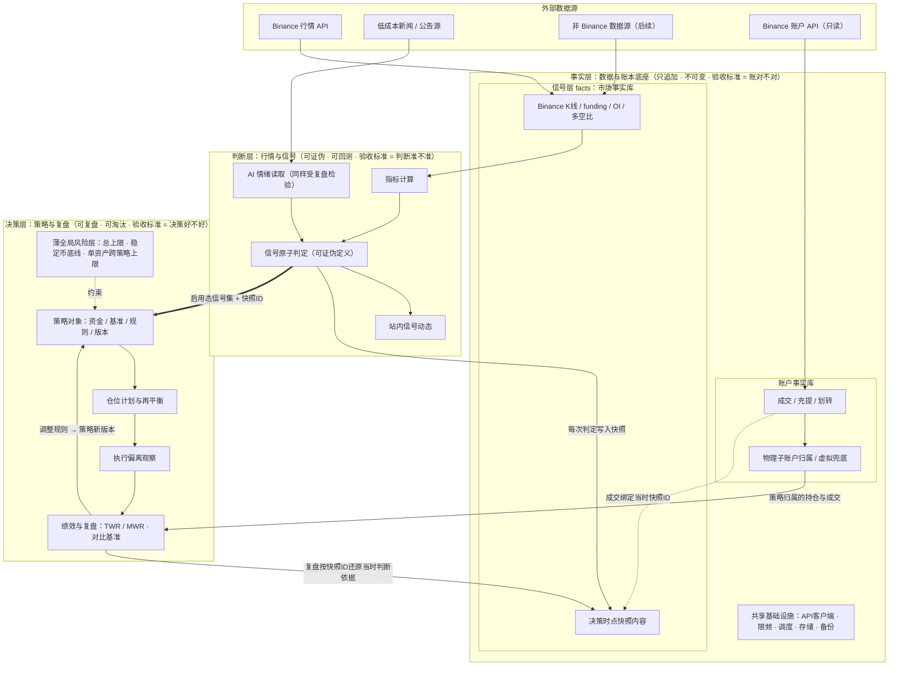

# 数字资产投资操作系统 · 总 PRD（v0.1）

> 文档定位：本文是三份子 PRD（账本层 / 信号层 / 策略层）的总纲，固化已达成共识的系统分层架构、层间契约、页面地图和子 PRD 拆分方式。
>
> 上游文档：《数字资产投资项目立项计划书 v0.2》。立项书回答"做什么、不做什么、为什么做"；本文回答"系统怎么组织"。两者冲突时以立项书的边界为准。
>
> 下游文档：三份子 PRD 各自展开本文对应层的细节。页面的具体交互与视觉在子 PRD 中细化，本文只定页面地图。已被 ADR 明确修订的事项（如物理子账户优先、信号原子优先）以对应 ADR 与子 PRD 为准。

---

## 一、系统分层架构

系统分为三层。判断任何功能、数据、争议的归属时，用一句话检验：

- **事实层**管"发生了什么"——不可变、只追加；
- **判断层**管"市场有哪些客观信号"——可证伪、可回测；
- **决策层**管"基于判断该做什么"——可复盘、可淘汰。

### 1.1 事实层：数据与账本底座

**验收标准：账对不对。**（账户事实对得上交易所，市场事实可被快照还原）

事实层按所有权拆成两个子域：

| 子域 | 内容 | 服务对象 |
| --- | --- | --- |
| 市场事实库（`src/signal/facts/`） | Binance K 线、公开衍生品数据、**决策时点快照内容**；后续可扩展 AI 情绪输出 | 属于信号层；复盘通过快照 ID 间接引用 |
| 账户事实库（`src/ledger/`） | 成交、充值、提现、划转、物理子账户归属、虚拟归属兜底、**决策时点快照容器** | 仅决策层 |
| 共享基础设施 | API 客户端、限频管理、定时调度、失败重试、存储、备份、监控告警 | 按使用方归属到 signal / ledger，不建横跨两层的业务真相 |

设计要点：

1. 两个子域均为只追加的事实数据，不可修改、不可删除；
2. 市场研判不读取账户事实库——市场信号不受个人持仓影响，避免"重仓所以看多"的污染；
3. 决策时点快照是 day one 必须做对的数据架构：信号层定义内容并写入，账本层提供容器与 `snapshot_id` 取回；
4. Phase 1 采用物理子账户优先：1 个实盘策略 = 1 个 Binance 子账户；虚拟归属只做外部钱包、异常交易、纸面策略等兜底；
5. 仅使用只读 API 密钥（Phase 1–3），无交易、无提现权限。

### 1.2 判断层：行情与信号

**验收标准：判断准不准。**

职责：市场事实采集 → 指标计算 → 信号原子判定 → 站内信号动态。

设计要点：

1. **无主观判断入口**：信号取值完全由数据规则得出，不提供人工覆写；
2. **信号可证伪**：每个信号原子由明确数据条件定义，Phase 1 不做单一综合市场状态；
3. 信号切换需定义频率与滞后容忍，避免信号抖动；
4. AI 情绪读取属于本层，其输出同样入库、同样回测准确率——系统中不存在不受复盘检验的模块；
5. 本层拥有市场事实库与快照内容 schema；写入仅限市场事实、信号取值与快照内容，不读取账户事实。

### 1.3 决策层：策略与复盘

**验收标准：决策好不好。**

职责：策略对象管理（资金 / 基准 / 规则 / 版本）、仓位计划与再平衡、执行偏离观察、绩效（TWR / MWR、对基准）、复盘草稿生成与确认。

设计要点：

1. 策略为第一公民：资金上限、基准、验证周期、再平衡规则、失效条件、复盘口径全部在策略对象内定义；
2. 薄全局风险层只做三条约束：加密总投入上限、稳定币最低保留、单资产跨策略合计上限；
3. 策略规则修改必产生新版本，历史交易按当时版本复盘；
4. 复盘结论反哺策略规则，形成闭环。

### 1.4 层间契约

1. **决策层只消费"启用态信号集 + 快照 ID"**，永远不直接读取原始行情数据；
2. **判断层与决策层不共享账本**：判断层对账户事实库零依赖；
3. 复盘通过快照 ID 还原任意历史时点的判断依据；
4. 成交记录绑定其发生时刻的快照 ID。

### 1.5 架构图

---

## 二、页面地图

前端共四个页面。页面的具体交互、字段与视觉在对应子 PRD 中细化，本节只固化"有哪些页面、各自定位、写操作边界"。

### 2.1 站内信号动态（Phase 1）

- 定位：在市场页 / 账本页 / 复盘页内呈现"该看了"；
- 内容：启用态信号切换、风险提醒、复盘待确认、同步 / 对账异常；
- 不包含账户敏感信息；
- Telegram / 飞书等外部 IM 推送不属于 Phase 1，待骨架跑通后单独评估。

### 2.2 市场页（对应判断层）

- 当前启用态信号集与信号切换时间线；
- 各输入维度数据面板：BTC/ETH 趋势结构、ETH/BTC 强弱、资金费率、持仓量、多空比、AI 情绪信号（观察态）；
- **快照查看器**：点击任意一次历史信号判定，还原当时系统看到的全部输入数据——"可证伪"的肉眼验证入口；
- 全页只读。

### 2.3 策略页（对应决策层）

- 策略列表：状态（观察 / 纸面 / 小仓验证 / 运行 / 暂停 / 淘汰）、资金使用、当前收益概览；
- 策略详情：持仓明细（来自物理子账户归属 / 虚拟兜底回放）、绩效对基准曲线（TWR / MWR）、执行偏离记录、规则全文与版本历史、分批计划进度；
- 写操作：修改策略规则（必产生新版本）、维护资产池。

### 2.4 复盘页（任务流，不并入策略页）

- 定位：有"待办—完成"状态的工作流，而非看板；
- 流程：系统按周期自动生成复盘草稿 → 使用者逐项确认 → 产出结论 → 结论可触发策略规则修改（跳转策略页，生成新版本）；
- 复盘历史归档，每份复盘引用所依据的快照 ID 与策略版本；
- 写操作：确认复盘结论。

### 2.5 账本页（对应事实层）

- 同步状态：各数据管道上次成功同步时间、失败告警；
- **对账面板**：系统回放余额 vs Binance 实际余额，差异高亮；
- **待归属交易队列**：自动同步但无法自动判断策略归属的成交，人工归属的兜底入口；
- 外部钱包 / 系统外交易的手工录入；
- 充提划转流水查询；
- 写操作：归属交易、录入外部交易。

### 2.6 前端设计原则

1. **写操作面极小**：全系统仅四类写操作——确认复盘、归属交易、修改策略（必产生新版本）、维护资产池。其余一律只读；
2. 行走骨架阶段优先级：市场页 + 账本页最简版先行，策略页与复盘页先用最朴素展示，骨架跑通后加宽。

---

## 三、子 PRD 拆分与撰写顺序

**撰写顺序：账本 → 信号 → 策略**（下游接口取决于上游数据结构）。开发顺序仍按行走骨架纵向切薄片，三层各做最小一片。

### 3.1 子 PRD 一：账本层 PRD（事实层）

核心议题：

1. 物理子账户优先的归属模型：策略 ↔ 子账户 ↔ key 绑定、划转如何记账、虚拟归属如何兜底、与交易所余额如何对账（**优先级最高**）；
2. 决策时点快照的存储方案与格式；
3. Binance 同步管道：成交 / 充提 / 划转的拉取、增量同步、失败重试；
4. 待归属交易的判定规则与人工兜底流程；
5. 外部交易手工录入的最小字段集；
6. 数据备份与保留策略；
7. 账本页功能细化。

### 3.2 子 PRD 二：信号层 PRD（判断层）

核心议题：

1. 第一版 Binance 源信号原子及每个信号的可证伪数据定义；
2. 信号切换的频率限制与滞后容忍；
3. 市场事实库（`src/signal/facts/`）的数据模型、采集与存储边界；
4. 各输入维度的指标定义与数据源落地（Phase 1 仅 Binance 行情 / 公开衍生品数据）；
5. AI 情绪信号：输出格式、来源标注、准确率回测口径；
6. 站内信号动态与提醒规则；
7. 市场页与快照查看器功能细化。

### 3.3 子 PRD 三：策略层 PRD（决策层）

核心议题：

1. 策略对象 schema（含版本化机制）；
2. 第一个策略实例：加密现货多资产中长期配置策略（基准：BTC 定投并持有）；
3. 仓位计划与再平衡规则的结构化表达；
4. 执行偏离的判定规则（偏离计划价格区间 / 仓位 / 时点、频率异常）；
5. TWR / MWR 计算口径与充提划转入账规则；
6. 复盘草稿的自动生成逻辑与确认流程；
7. 薄全局风险层三条约束的具体数值；
8. 策略页与复盘页功能细化。
9. 范围排除：策略发现（假设库、纸面跟踪）属 Phase 2，本 PRD 第一版不含。

---

## 四、行走骨架（Phase 1 范围对照）

硬时间盒 6–8 周，跨三层各取最薄一片：

| 层 | 骨架范围 |
| --- | --- |
| 事实层 | Binance 只读同步（成交/充提/划转）+ 物理子账户归属 / 虚拟兜底 v0 + 快照容器 v0 |
| 判断层 | Binance 源市场事实库 + 信号原子 v0（最简可证伪定义）+ 站内信号动态 |
| 决策层 | 一张中长期配置策略卡 + 自动周复盘草稿 |
| 前端 | 市场页 + 账本页最简版 |

骨架跑通之前，不增加任何功能。

---

## 五、开放问题（待子 PRD 解决）

1. 物理子账户数量上限、主账户不交易约束、子账户间划转规则的 API 实测确认；
2. 信号原子的具体数据定义与阈值；
3. 市场事实库在 `src/signal/facts/` 下的字段类型与存储实现；
4. 情绪数据源成本（尤其 X API）是否可接受，及替代方案；
5. 美股 / 宏观 high-level 数据源选型（Phase 1 延后）；
6. 全局风险层三条约束的具体数值（与个人总净资产挂钩）；
7. 快照的数据体量与存储成本估算；
8. 技术栈选型（不在本文范围，立项后单独决策）。
