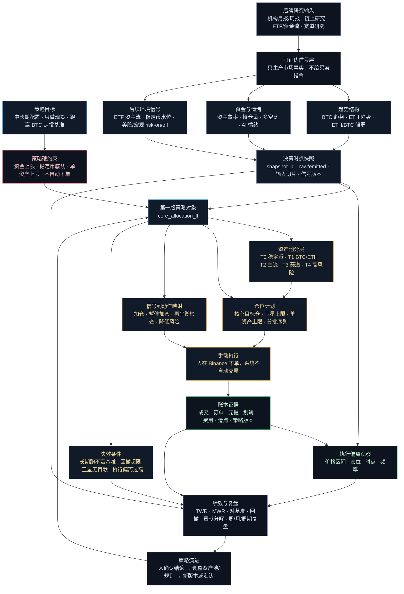

# 第一版策略决策依赖图 v0.1

> 文档定位：本文件是「加密现货多资产中长期配置策略」的讨论辅助图，用于把第一版策略从行业参考、核心指标、策略规则到执行追踪的关系画清楚。
>
> 上游依据：
> - `docs/prd/数字资产投资项目立项计划书_v0.2.md`
> - `docs/prd/数字资产投资操作系统_总PRD_v0.1.md`
> - `docs/prd/信号层PRD_v0.1.md`
> - `docs/prd/策略层PRD_v0.1.md`
>
> 范围：只覆盖 Phase 1 的第一版实盘策略：`core_allocation_lt`（加密现货多资产中长期配置策略）。不覆盖 Phase 2 的策略发现、纸面跟踪、多策略调度。

---

## 一、图 1：从上至下的策略决策关系

这张图回答：**第一版策略从哪里来、依赖哪些判断、最终如何变成可执行计划与复盘闭环。**

### 读图方式

- 顶层先回答「为什么投」：中长期现货配置，目标是长期跑赢 BTC 定投基准，而不是预测短期价格。
- 中层回答「依据是什么」：行业资料和市场数据必须先落成可证伪信号，不能直接变成买卖动作。
- 策略层回答「该做什么」：同一批信号如何解释，完全写进策略规则，且规则变更必须产生新版本。
- 底层回答「做得怎样」：成交、费用、滑点、偏离、绩效和复盘共同审判策略是否继续存在。

---

## 二、图 2：第一版策略的核心指标依赖矩阵

这张表回答：**每一层依赖哪些指标，以及这些指标在第一版策略里负责解决什么问题。**

| 决策层级 | 核心问题 | 第一版核心指标 / 证据 | 数据来源 / 参考来源 | 第一版用途 |
| --- | --- | --- | --- | --- |
| 策略目标 | 这个策略在赌什么 | 跑赢 BTC 定投基准；中长期 2-4 年验证；只做现货 | 立项书、策略层 PRD、长期配置研究 | 定义 `thesis`、`benchmark`、`validation_period` |
| 硬风险约束 | 什么绝对不能击穿 | 加密总投入上限、稳定币最低保留、单资产跨策略上限 | 人按净资产配置；策略层风险层 | 事前限制仓位计划，事后触发风险提醒 |
| 市场趋势 | 市场是否处于可配置环境 | BTC 趋势结构、ETH 趋势结构、ETH/BTC 强弱 | Binance Spot K 线；机构市场评论作框架参考 | 决定分批配置、观察、暂停加仓的背景条件 |
| 资金与情绪 | 是否过热或拥挤 | 资金费率、持仓量变化、多空比；AI 情绪信号后续 | Phase 1：Binance funding / futures data；新闻/公告/社交源延后 | 识别暂停加仓、降低风险、只观察的条件 |
| 外部环境 | 风险偏好是否支持加密配置 | ETF 资金流、稳定币供应、宏观 risk-on/off | Farside、DefiLlama、机构宏观评论等 | Phase 1 不纳入决策依赖；后续调研后再进入信号层 |
| 资产选择 | 哪些资产能进入策略资产池 | 资产层级、流动性、赛道位置、与 BTC/ETH 关系、相对强弱、是否允许真实买入 | Messari、Glassnode、交易所数据、资产研究报告 | 维护 T0-T4 资产池与最大仓位 |
| 仓位计划 | 买多少、何时买、如何分批 | 核心仓目标、卫星总上限、单资产上限、首批比例、后续批次条件 | 策略规则 + 启用信号 + 风险约束 | 产出分批建仓计划与再平衡目标 |
| 执行质量 | 实际交易是否符合计划 | 成交价 vs 计划区间、成交后仓位、成交时点、交易频率、手续费、滑点 | Binance 成交/订单同步；账本事件流 | 周复盘执行纪律，发现计划不现实或执行偏离 |
| 策略有效性 | 这套复杂度是否值得 | TWR、MWR、对 BTC 定投基准、最大回撤、核心/卫星贡献、偏离次数 | 账本回放 + 快照 + 策略版本 | 月复盘和周期复盘；决定新版本、暂停或淘汰 |

---

## 三、第一版策略落地顺序

这部分回答：**从行业参考到第一张策略卡，应该按什么顺序收敛。**

---

## 四、第一版策略的最小决策清单

第一版策略不追求完整，只需要先把下列决策定清楚：

| 决策 | 第一版建议 | 为什么 |
| --- | --- | --- |
| 策略名称 | 加密现货多资产中长期配置策略 | 与 Phase 1 范围一致 |
| 策略 ID | `core_allocation_lt` | 稳定引用，供账本与复盘绑定 |
| 基准 | BTC 定投并持有 | 用来判断复杂度是否有价值 |
| 核心资产 | BTC / ETH | 符合项目第一阶段核心资产边界 |
| 卫星资产 | 先观察 T2/T3，不急于实盘买入 | 避免第一版过早扩张 |
| 高风险资产 | T4 只观察或极小验证 | 符合「高风险只能试验」原则 |
| 加仓依据 | 启用态信号的 `emitted_value` | 避免策略层绕过信号层 |
| 暂停依据 | 防守/过热类条件优先于加仓条件 | 防止一边过热一边机械加仓 |
| 执行方式 | 人在 Binance 手动下单 | Phase 1 不自动下单 |
| 复盘口径 | 周看执行纪律，月看表现，周期看有效性 | 避免用短期噪声审判中长期策略 |

---

## 五、设计边界

- 本图不是系统架构图；系统架构以总 PRD 和三份子 PRD 为准。
- 本图不是正式 ADR；若未来固化为跨层契约，需新增 ADR。
- 本图不定义具体仓位比例、阈值和价格区间；这些应进入第一版策略档案 `docs/strategies/core_allocation_lt.md`。
- 本图不允许策略层直接读取原始行情；需要新指标时，应先进入信号层注册表。
