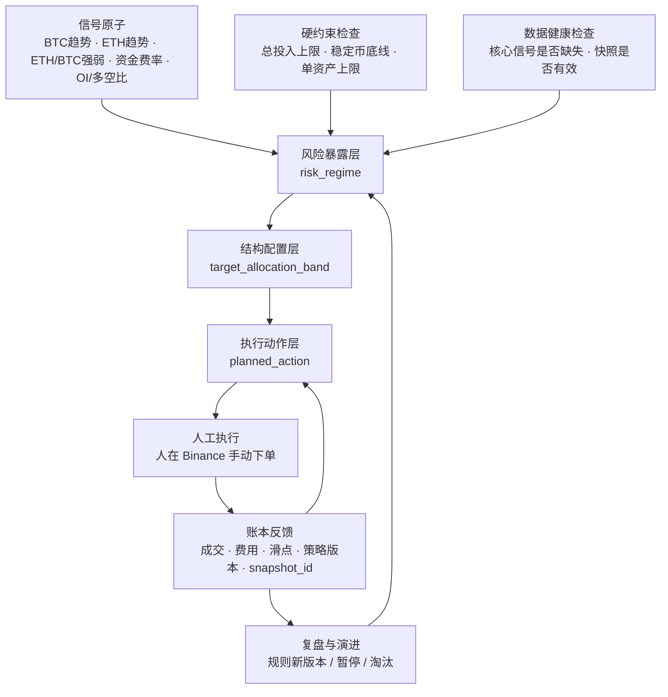

# 策略层 PRD（决策层 · 策略与复盘）v0.1

> 文档定位：三份子 PRD 之一，展开决策层——把判断层的客观信号与账本层的账户事实，收敛成**可复盘、可淘汰**的投资决策与复盘闭环。它是三层中最后一层、闭环的收口处。
>
> 上游文档：《数字资产投资操作系统_总PRD_v0.1》§1.3、§2.3–§2.4、§3.3；《数字资产投资项目立项计划书_v0.2》§5、§12、§14。
> 决策依据：`docs/decisions/0005-strategy-layer-methodology-baseline.md`（策略层方法论基线：策略为第一公民 · 信号→动作映射归策略 · 版本化复盘 · AI 仅润色）。
> 上游契约：信号层 PRD §0.3（活跃信号集 + `snapshot_id`）、账本层 PRD §0.3（策略归属持仓与成交 + 现金流事实）。
> 视觉依据：`design/数字资产投资操作系统_视觉说明.html` + ADR-0002。
>
> 本版范围：第 0–10 章全部完成。开放问题与待办见第 10 章。

---

## 第 0 章 定位与边界

### 0.1 策略层职责

策略层回答一个问题：**「基于市场判断，该做什么；以及做得好不好」——并且这个决策可被复盘、可被淘汰。** 验收标准 = 决策好不好（不是短期赚没赚，而是是否按规则运行、是否跑赢自身基准、复盘是否真的反哺了下一轮决策）。

职责链（总 PRD §1.3）：**策略对象管理（资金/基准/规则/版本） → 仓位计划与再平衡 → 执行偏离观察 → 绩效（TWR/MWR、对基准） → 复盘草稿生成与确认**。它包含四块：

1. **策略对象**：自包含的完整投资单元（资金/基准/资产池/规则/版本/失效条件/复盘口径），是本系统的第一公民。
2. **计划与执行观察**：把策略规则落成结构化的仓位计划与再平衡规则，并客观标记实际成交相对计划的偏离。
3. **绩效测量**：TWR/MWR 双轨、永远对自身基准。
4. **复盘闭环**：系统自动生成复盘草稿、人确认结论、结论反哺规则（产生新版本）。

### 0.2 四条红线（不可绕过）

1. **只消费信号 + 快照，永不读原始行情**：决策层只吃信号层的「活跃信号集 + `snapshot_id`」（总 PRD §1.4 契约1），永不直接读行情、永不绕过信号层私算指标。需要新维度 → 去信号层加信号（ADR-0005 决策 2）。
2. **规则改即新版本，历史按当时版本复盘**：禁止后视镜——不得用今天的规则解释昨天的成交（ADR-0005 决策 3）。
3. **人是唯一拍板者**：系统只生成草稿与客观标记；改资产池、改策略规则、确认复盘结论必须由人确认。AI 在本层**仅做复盘草稿文字润色**，不碰任何决策（ADR-0005 决策 8）。
4. **只读、不下单、不碰密钥**：Phase 1 不接自动下单、不接交易权限 key（立项书 §6.2、§16.6）；策略层不读取任何 Binance key / secret，只产出「计划与判断」，下单由人在 Binance 手动执行，成交经账本层同步回来。

### 0.3 层间接口（契约）

| 方向 | 策略层提供 / 消费 | 说明 |
| --- | --- | --- |
| ← 信号层 | **活跃信号集 + `snapshot_id`**（仅**启用**态信号） | 决策层据此判断「该做什么」；信号→动作映射写在策略规则里（第 3 章） |
| ← 账本层 | **策略归属的持仓与成交**（按 策略 + 版本） | 据此算 TWR/MWR、对基准、再平衡缺口、执行偏离（账本 PRD §0.3） |
| ← 账本层 | **现金流事实**（充提 + 主↔子划转） | 绩效计算的入账依据；账本只记事实，**TWR/MWR 口径归本层**（第 6 章） |
| ← 账本层 | **策略 ↔ 子账户绑定状态 + 凭证健康摘要** | 只读消费 `active` / `blocked` / `WARN` 等状态，用于运行前置与页面提示；不消费 `key_ref` / API key / secret |
| → 账本层 | **策略对象与版本**（供成交绑定 `strategy_version`） | 账本按成交时点取当时版本绑定（账本 PRD §1.4.5）；策略定义是源，账本只引用 |
| → 复盘 ↔ 信号层 | 按 `snapshot_id` 还原当时市场判断依据 | 复盘无后视镜偏差的前提（总 PRD §1.4 契约3） |
| ⊗ 原始行情 | **无此连接** | 红线1：策略层不直接读行情 |
| ⊗ Binance 凭证 | **无此连接** | Binance key / secret 归账本层；策略层只引用绑定结果 |

> 物理子账户（账本 ADR-0003）：1 实盘策略 = 1 Binance 子账户，故「策略归属」在账本层几乎白送（账本 PRD §1.1）。策略层消费的是已归属好的持仓与成交，不自己做归属。

### 0.4 范围（Phase 1）

**做**：
- 策略对象 schema + 版本化机制（第 1 章）；
- 薄全局风险层三条约束的**结构**与配置方式（第 2 章）；
- 信号消费契约：策略规则如何把「活跃信号集」映射成动作（第 3 章）；
- 仓位计划与再平衡规则的结构化表达（第 4 章）；
- 执行偏离观察的判定规则（第 5 章）；
- TWR/MWR 计算口径 + 充提划转入账规则（第 6 章）；
- 复盘草稿自动生成逻辑 + 确认流程 + 闭环（第 7 章）；
- **一个**策略实例：加密现货多资产中长期配置策略卡（第 8 章）；
- 策略页 + 复盘页（第 9 章）。

**不做**（Phase 1）：
- **策略发现**：假设库、纸面跟踪机制、小仓验证机制、多策略状态流转（属 Phase 2，总 PRD §3.3 范围排除、ADR-0005 决策 10）；
- 多策略并存与跨策略调度（Phase 1 仅激活 1 个策略）；
- 自动下单、止损止盈自动执行、仓位自动建议（Phase 4+）；
- AI 参与决策/择时/价格预测/自动归因（永久红线，立项书 §十）；
- 全局风险层三条约束的**具体数值**（与个人总净资产挂钩，由人配置，见 §2.4 与第 10 章）。

---

## 第 1 章 策略对象模型与版本化

### 1.1 心智模型

> **策略是本系统的第一公民：一个自包含的完整投资单元，自带资金、基准、规则、版本与生与死的条件。系统不在策略之上再叠一个「聪明的全局大脑」——全局只保留一层薄薄的硬风险约束。**

由此推出本层的形态（ADR-0005 决策 1、立项书 §5）：

- 一切「该投多少、跟谁比、什么规则、什么时候算失败」都**下沉到策略对象内**；策略之间各自独立。
- 策略之上**只有薄全局风险层**三条硬约束（第 2 章），不做复杂调度/择时——避免再造一个不可证伪的顶层大脑（与信号层「不做单一综合市场状态」同一种克制）。
- 持仓、绩效、偏离全是**派生视图**，由账本事件流 + 策略定义回放算出，不是源数据（§1.6、ADR-0005 决策 9）。

### 1.2 策略对象的标准结构

每个策略按统一结构定义。这是策略页（第 9 章）、绩效（第 6 章）、复盘（第 7 章）的共同地基——**每加一个策略都往这个模子里填**。

| 字段 | 含义 | 约束 |
| --- | --- | --- |
| `strategy_id` | 稳定唯一标识（如 `core_allocation_lt`） | 一旦发布不可改名（成交按它归属） |
| `name` / `summary` | 人读名称与一句话简述 | — |
| `thesis` | **投资假设**：这个策略在赌什么、为什么相信它能跑赢基准 | 可证伪的起点；写进策略档案 |
| `capital_cap` | **资金上限**：该策略可动用的最大资金 | 受薄全局风险层约束（第 2 章）；总资金定义在本层 |
| `benchmark` | **基准**：绩效永远与它并列；中长期配置建议「BTC 定投并持有」 | **必填**；跑不赢基准是核心失效条件（§1.5） |
| `asset_pool_ref` | **资产池子集**：引用全局分层资产池（T0–T4）的子集 | 每资产记最大允许仓位、是否允许真实买入（立项书 §8） |
| `validation_period` | **验证周期**：有效性的最短验证窗口 | 中长期可能需一个完整市场周期（2–4 年）；与执行纪律周验证分离 |
| `entry_exit_rules` | 入场/出场/加减仓规则（结构化，可被偏离检查引用） | 引用信号（第 3 章）+ 仓位计划（第 4 章） |
| `rebalance_rule` | 再平衡规则（阈值/频率/方式） | 第 4 章 |
| `invalidation_conditions` | **失效条件**：可证伪的淘汰条件 | 至少含「长期跑不赢基准」（§1.5） |
| `review_spec` | **复盘口径**：复盘指标与周期 | 第 7 章；执行纪律周期 vs 有效性周期分离 |
| `version` | 版本号；**改任一规则字段即产生新版本**（只追加） | 历史成交按当时版本复盘（§1.4） |
| `lifecycle_state` | 状态机：`观察`/`纸面`/`小仓验证`/`运行`/`暂停`/`淘汰`（§1.3） | Phase 1 主要走「运行」 |
| `bound_account_ref` | 绑定的子账户（实盘）/外部钱包 | 只保存账本层账户引用和健康摘要；不保存 key / secret；归属由账本派生 |

> `version` 与 `lifecycle_state` 的区别：前者是「规则定义变了」（只追加历史，按当时版本复盘），后者是「这个策略现在处于一生中的哪个阶段」（可流转 + 可审计）。与信号层 `version`/`lifecycle_state` 同构（信号 PRD §1.2）。

### 1.3 策略状态机（生命周期）

策略一生的状态（立项书 §5、总 PRD §2.3）：

| 状态 | 真实资金 | 进绩效/复盘 | Phase 1 |
| --- | --- | --- | --- |
| **观察** | ❌ | 仅记假设 | 预留 |
| **纸面跟踪** | ❌（虚拟记账） | ✅（纸面账本，Phase 2） | **不做**（账本 PRD §0.4：纯虚拟模拟账本推迟 Phase 2） |
| **小仓验证** | 极小仓 | ✅ | 预留 |
| **运行** | ✅ | ✅ | **Phase 1 主路径** |
| **暂停** | 持仓冻结、不新增 | ✅ | 预留 |
| **淘汰** | 清退/归档 | 档案不删，追加淘汰原因 | 预留 |

约束：
- 生命周期状态切换必须**落库 + 可审计**（谁、何时、为何），调性同账本/信号 audit。
- 进入「运行」前置：①有明确 `thesis` + `benchmark` + `invalidation_conditions`；②有 `review_spec`；③绑定一个通过安全体检、未 `blocked` 的只读子账户（账本 PRD §3.3）；若凭证健康为 `WARN`，策略可运行但页面必须提示风险。
- Phase 1 单策略硬编码实例化（第 8 章），状态机全套为 Phase 2 多策略预留（ADR-0005 决策 10）。

### 1.4 版本化机制（历史按当时版本复盘）

ADR-0005 决策 3 落地为本层最重要的工程约束：

- **一处定义，回放消费**：策略规则在策略对象内定义；仓位计划、偏离判定、复盘**都按当时生效的版本解释**——杜绝「今天改了规则，昨天的成交跟着被重新评判」。这与账本「事件流唯一真相」、信号「定义只追加」是同一种洁癖。
- **改任一规则字段 = 新 `version`**（只追加，旧版本不删）。规则字段 = `entry_exit_rules` / `rebalance_rule` / `invalidation_conditions` / `capital_cap` / `benchmark` / `asset_pool_ref` / `review_spec`。`name`/`summary` 等描述性改动不强制新版本（但建议记一笔）。
- **成交绑定版本**：每笔成交按其 `time` 绑定当时生效的 `strategy_version`（账本侧字段，账本 PRD §1.4.5；策略层是该字段的**版本真相源**，账本按时点查询）。
- **复盘标注版本**：每份复盘报告标注所依据的 `strategy_version` 与 `snapshot_id`（§1.4 复盘契约）。

### 1.5 失效条件与「可淘汰」

策略必须能死（呼应「可淘汰」信条，立项书 §16.5）：

- **核心失效条件（必含）**：**策略长期跑不赢自身基准** → 复杂度净价值为负 → 应淘汰（立项书 §5 基准定义、ADR-0005 决策 6）。「长期」按 `validation_period` 衡量，不被短期噪声触发。
- 其它可证伪失效条件由策略自定义（如最大回撤超限、假设被证伪）。
- **淘汰 ≠ 删除**：进「淘汰」态，策略档案（`docs/strategies/<strategy_id>.md`，§1.7）追加「何时淘汰、为何淘汰、学到什么」，与信号档案对称。

### 1.6 派生原则（不持久化派生）

承接账本 PRD §1.6 纯函数回放（ADR-0005 决策 9）：

- 策略持仓、成本、已实现/未实现盈亏、TWR/MWR、再平衡缺口、执行偏离——**全部由账本事件流（策略归属成交 + 现金流）+ 策略定义回放现算**，源头是账本与策略定义，不在策略层另存派生真相。
- 任意历史时点的策略账面 = 把账本回放的 `asOf` 设为该时刻 + 取当时 `strategy_version`。
- 本项目量级（单策略、年成交数百~千条）下回放为毫秒级，Phase 1 不做投影表（再评估触发条件同账本 §1.6）。

### 1.7 策略档案（知识沉淀，与信号册对称）

- 每个策略的一生（假设演化、版本历史、绩效对基准、淘汰原因、反思）记录在 `docs/strategies/<strategy_id>.md`（一策略一档案，只追加）。
- 策略对象是**运行时真相**，策略档案是**知识沉淀**，二者互补（与信号册 ADR-0004 决策 7 对称）。`docs/strategies/` 的约定与「新增一个策略 checklist」在落地第 8 章策略卡时建立。

### 1.8 不变式 / 约束

1. **自包含**：策略所需的资金/基准/规则/失效条件全在策略对象内，不依赖外部隐式配置。
2. **基准必填**：无基准的策略不得进「运行」——否则绩效无法证伪。
3. **版本只追加**：规则变更产生新版本，旧版本不删；历史决策永远按其记录的版本解释。
4. **资金受薄风险层约束**：`capital_cap` 之和与单资产合计受第 2 章三条硬约束限制。
5. **派生不撒谎**：持仓/绩效全部从账本事件流 + 策略定义回放，不与账本并存第二份真相。

---

## 第 2 章 薄全局风险层

### 2.1 定位

策略各自独立，但策略层之上保留**一层极薄的全局风险层**，只做三条**硬约束**（任何策略不得击穿，立项书 §5.1、总 PRD §1.3）。它不做择时、不做调度、不做信号解读——只是三道护栏。

### 2.2 三条硬约束

| # | 约束 | 形式 | 作用 |
| --- | --- | --- | --- |
| 1 | **加密总投入上限** | 所有策略 `capital_cap` 之和 ≤ 上限 | 控制加密资产对个人总净资产的暴露 |
| 2 | **稳定币最低保留比例** | 全局稳定币（T0）占比 ≥ 下限 | 防守底线，任何策略不得击穿 |
| 3 | **单资产跨策略合计上限** | 同一资产在所有策略的合计仓位 ≤ 上限 | 防止多策略不约而同重仓同一资产 |

### 2.3 校验时机与口径

- **校验输入**：来自第 1 章回放出的各策略持仓（含现金腿）+ 各策略 `capital_cap`。
- **校验时机**：① 制定/调整仓位计划时（事前，第 4 章）；② 每轮账本同步 + 对账后（事后，复用账本对账心跳）；③ 复盘时（回顾期内是否曾击穿）。
- **击穿处理**：Phase 1 无自动下单，故风险层**只告警、不自动平仓**——命中即站内提醒（不含敏感信息）+ 策略页/复盘页高亮，由人决定如何回到护栏内；外部推送延后。
- 单资产合计上限的「单资产」按 base 资产聚合，跨策略求和（Phase 1 单策略时退化为该策略单资产上限）。

### 2.4 具体数值（与个人总净资产挂钩，由人配置）

三条约束的**具体数值与个人总净资产强相关**，不在 PRD 中硬编码（同信号层不硬编码阈值、ADR-0004 决策 3 的精神）：

- 数值以**配置项**形式存在（如 `crypto_total_cap`、`stablecoin_floor_ratio`、`single_asset_cross_cap`），由人按总净资产设定、可审计、改动留痕。
- 推荐表达：总投入上限与单资产上限可表达为「占个人总净资产的百分比」或绝对额；稳定币下限为百分比。具体band 待人输入（第 10 章开放问题1）。
- 与立项书 §19 预算口径一致：预算/暴露超限本身是一个**需要复盘的信号**。

### 2.5 不变式

1. **三条是硬约束**：任何策略的计划与实际持仓都不得击穿；击穿必告警。
2. **薄**：全局层只有这三条，不在此处做任何信号解读或择时——那是各策略规则的事。
3. **可审计**：三个数值的设定与变更留痕（谁、何时、为何、改成多少）。

---

## 第 3 章 信号消费契约（决策层如何用信号）

### 3.1 定位：信号是事实，动作是策略的解读

> **信号层只陈述「市场是什么状态」；「这意味着该做什么」完全是策略层的事。同一条 `btc_trend = 下降`，定投策略可能无视、趋势策略可能减仓——区别全在策略规则里，不回灌信号层。**

这是 ADR-0004「生产消费分离」的消费侧落地（ADR-0005 决策 2）。由此：

- **决策层只消费「活跃信号集 + `snapshot_id`」**（仅**启用**态信号；观察/影子态对策略不可见，信号 PRD §1.4）。
- **永不直接读行情、永不私算指标**：需要新维度 → 去信号层加信号原子，不在策略层私接数据源（红线1）。
- 信号→动作的映射写在策略 `entry_exit_rules` / `rebalance_rule` 里，是**策略定义的一部分**，随策略版本化（§1.4）。

### 3.2 消费的数据形态

策略每次做决策时，从信号层取一份**当前快照**（或复盘时取历史快照），其内容（信号 PRD §5.3）：

- **活跃信号集**：每个启用信号的 `signal_id` + `emitted_value`（防抖后发布值，策略消费的是这个，不是 `raw_value`）+ `version`。
- `snapshot_id`：本次决策绑定的快照 ID，使「当时看到哪些信号、取值是什么」可还原（§3.5）。

> 策略消费 `emitted_value`（防抖后），因为这是信号层正式对外发布、稳定的取值（信号 PRD §2.4）；`raw_value` 只在复盘检查防抖松紧时看，不驱动决策。

### 3.3 信号→动作的映射（写在策略规则里）

策略规则把信号取值映射成动作，结构化表达，可被偏离检查引用。形态示例（具体规则在第 8 章策略卡 / 策略档案定）：

| 规则要素 | 含义 | 示例（仅示意，非最终定义） |
| --- | --- | --- |
| `when` | 触发的信号条件（可组合多信号） | `btc_trend_structure == 下降 AND funding_sentiment == 偏高` |
| `then` | 动作 | `暂停加仓` / `下一批建仓减半` / `触发再平衡检查` |
| `applies_to` | 作用的资产/仓位范围 | 核心仓 / 卫星仓 / 全策略 |
| `guard` | 受薄风险层与仓位计划上限约束 | 不得击穿第 2 章三条 |

- 动作只是**计划层面的**（暂停加仓、调整下一批比例、提示再平衡）；Phase 1 不自动下单，动作产出的是「该做什么」的计划与提醒，由人执行（红线4）。
- 多条规则可同时命中；冲突消解顺序（如「防守优先于加仓」）在策略卡内定义。

> 关键约束：策略层不允许让多条信号各自产生互相冲突的动作。信号先被策略规则合成为一个**策略决策状态**，再从决策状态推导目标配置，最后由当前持仓与目标配置的差额生成计划动作。

### 3.4 缺信号 / 信号不可用的降级

- 若某依赖信号处于**关闭/淘汰**态，或快照中缺失（取数失败、地理限制命中，信号 PRD §3.5）→ 依赖它的规则**不触发动作，并标记「因信号缺失未决策」**，进复盘可见，绝不用旧值或猜测替代（呼应可证伪）。
- 信号开关变动改变策略可见信号集，故每个决策绑定当时 `snapshot_id`，复盘按当时的活跃信号集解释（信号 PRD §5.6 不变式2）。

### 3.5 决策的可复盘绑定

每个策略决策事件（计划/再平衡触发/偏离判定）记录：
- `snapshot_id`（市场判断依据）+ `strategy_version`（规则依据）+ 输入的账本持仓快照（事实依据）。
- 三者使「当时为什么这么决策」可独立还原（ADR-0005 决策 4）；缺一即有后视镜偏差。

### 3.6 多信号合成模型：风险暴露 → 结构配置 → 执行动作

第一版策略采用**优先级规则驱动的有限状态机 + 目标仓位带模型**。它分三层：

1. **风险暴露层**：把硬约束、数据健康、BTC 趋势、资金费率等信号合成为一个 `risk_regime`，回答「现在应该承担多少 crypto 总风险」。
2. **结构配置层**：在 `risk_regime` 允许承担风险的前提下，结合 ETH/BTC 强弱、ETH 趋势、资产池层级与上限，生成 `target_allocation_band`，回答「风险资产内部怎么配」。
3. **执行动作层**：用账本回放出的当前持仓对比 `target_allocation_band` 与分批计划，生成 `planned_action`，回答「下一步实际该提示什么动作」。



#### 3.6.1 风险暴露层：信号 → `risk_regime`

`risk_regime` 是策略层对多信号的第一层合成结果。它不是信号层输出，也不是单独市场状态层；它是**当前策略版本**对活跃信号集的解释。

| 状态 | 核心含义 | 典型触发 | 策略倾向 |
| --- | --- | --- | --- |
| `no_decision` | 核心信号缺失或快照异常 | 核心依赖信号缺失、快照无效、数据健康检查失败 | 不生成配置动作；记录「因信号缺失未决策」 |
| `defensive` | 不应新增风险暴露 | 硬约束击穿/逼近；BTC 趋势下降且过热；其它防守条件命中 | 暂停新增买入；必要时触发降低风险评估 |
| `observe` | 市场方向不清晰 | BTC 趋势下降或震荡，但未触发极端防守 | 不标准加仓；等待更清晰信号 |
| `probe` | 允许小批量试探 | BTC 震荡，资金费率中性/偏低 | 允许小批次建仓，不执行标准批次 |
| `standard_allocate` | 允许按计划配置 | BTC 趋势上升或结构改善，资金费率不过热 | 按分批计划执行下一批 |
| `overheated_pause` | 趋势虽好但不追高 | BTC 趋势上升但资金费率偏高/拥挤 | 延后或减半下一批，避免追高 |

冲突消解优先级：

```text
硬约束 > 数据健康 > 防守/过热条件 > BTC 主趋势 > 资金费率温度 > 结构配置信号 > 影子信号
```

含义：
- 硬约束是一票否决；不得因任何看多信号击穿总投入上限、稳定币底线或单资产上限。
- 核心数据缺失时不得沿用旧判断或猜测，进入 `no_decision`。
- BTC 主趋势决定整体风险暴露；ETH/BTC 强弱不允许推翻 `risk_regime`。
- OI、多空比等影子信号在 Phase 1 只进快照和复盘，不驱动 `risk_regime`。

#### 3.6.2 结构配置层：`risk_regime` → `target_allocation_band`

结构配置层只在 `risk_regime` 允许承担风险时生效。它不回答「要不要新增 crypto 总仓位」，只回答「允许配置的 crypto 仓位内部怎么分」。

| 输入 | 作用范围 | 输出 |
| --- | --- | --- |
| `risk_regime` | 全策略 | 决定目标总风险暴露和稳定币目标带 |
| `eth_btc_strength` | 核心仓内部 | 决定 BTC/ETH 目标带向 ETH 或 BTC 倾斜 |
| `eth_trend_structure` | ETH 权重上限 | ETH 趋势下降时，不因 ETH/BTC 短期走强提高 ETH 权重 |
| 资产池层级与上限 | 核心/卫星/高风险 | 限制 T2/T3/T4 的目标带 |
| 薄风险层 | 全策略 | 校验目标带不得击穿全局硬约束 |

关键规则：
- `defensive` / `no_decision` 状态下，结构配置层不得产生新增风险资产目标。
- `eth_btc_strength` 只影响 BTC/ETH 内部目标带，不影响 crypto 总风险暴露。
- 卫星资产与高风险资产的目标带由资产池和上限控制，不能因为单一信号走强而突破上限。

#### 3.6.3 执行动作层：目标配置 → `planned_action`

执行动作层把「目标配置」转换成「人可执行的计划提示」。它的输入包括：
- `target_allocation_band`；
- 账本回放出的当前持仓与稳定币余额；
- 分批计划进度；
- 再平衡规则；
- `strategy_version` 与当前 `snapshot_id`。

| `planned_action` | 含义 |
| --- | --- |
| `no_action` | 当前持仓已在目标带内，或不满足动作条件 |
| `pause` | 暂停新增买入 |
| `next_tranche` | 执行下一批标准建仓提示 |
| `half_tranche` | 下一批减半或小批试探 |
| `rebalance_check` | 当前配比偏离目标带，提示再平衡缺口 |
| `risk_reduce_review` | 风险层或策略规则提示降低风险，由人确认后执行 |

`planned_action` 只是一条计划层输出，不直接改变持仓。真实持仓变化必须经过人工执行，随后由账本同步成交、费用、滑点、`strategy_version` 与 `snapshot_id`，再回到下一轮决策。

### 3.7 不变式

1. **零行情直读**：策略输入只有「活跃信号集 + 快照 + 账本持仓」，不含任何原始行情。
2. **消费发布值**：驱动决策用 `emitted_value`；`raw_value` 仅复盘用。
3. **先合成再动作**：多个信号必须先合成为 `risk_regime` 与 `target_allocation_band`，不得各自产生互相冲突的直接动作。
4. **映射随版本**：信号→策略状态→目标配置→计划动作的规则是策略定义的一部分，变更即新版本。
5. **缺信号显式降级**：信号不可用时不猜测、不沿用旧值，显式标记未决策。

---

## 第 4 章 仓位计划与再平衡

### 4.1 定位

把策略规则落成**结构化的仓位计划**：在 `capital_cap` 内明确各层资产的目标仓位、建仓节奏、加/暂停条件、再平衡规则（立项书 §14.4 模块四）。计划是「执行偏离观察」（第 5 章）的基准线。

仓位计划不由单个信号直接触发，而是承接第 3.6 节的三层模型：`risk_regime` 决定总风险暴露，`target_allocation_band` 定义目标仓位带，执行动作层再根据当前持仓与目标带的差额生成计划提示。

### 4.2 仓位计划的结构化表达

| 计划要素 | 含义 | 约束 |
| --- | --- | --- |
| `stablecoin_floor` | 稳定币最低保留比例（策略级） | ≥ 薄风险层全局下限（第 2 章约束2） |
| `risk_regime_policy` | 风险暴露层状态与优先级规则 | 第 3.6 节；变更即新版本 |
| `target_allocation_band` | 各资产/资产层级的目标仓位带 | 由 `risk_regime` + 结构配置信号生成 |
| `core_target` | 核心资产（T1：BTC/ETH）目标仓位 | 核心可以重（立项书 §14.4 原则） |
| `satellite_cap` | 卫星资产（T2/T3）总仓位上限 | 卫星必须轻 |
| `single_asset_cap` | 单资产最大仓位 | ≤ 薄风险层单资产合计上限（约束3） |
| `single_sector_cap` | 单赛道最大仓位 | — |
| `high_risk_cap` | 高风险资产（T4）总仓位上限 | 只能试验 |
| `first_tranche` | 首笔建仓比例 | 分批建仓起点 |
| `add_conditions` | 后续加仓条件（引用 `risk_regime` / 策略状态） | 可证伪触发 |
| `pause_conditions` | 暂停加仓条件（引用 `risk_regime` / 策略状态） | 可证伪触发 |
| `rebalance_rule` | 再平衡规则（§4.4） | 阈值/频率/方式 |

> 原则（立项书 §14.4）：**核心资产可以重，卫星资产必须轻，高风险资产只能试验。**

### 4.3 分批建仓计划

- 计划表达为**分批序列**：每批的触发条件（时间节奏 + `risk_regime` 条件）、比例、目标资产。
- 分批计划消费的是策略层合成后的 `risk_regime`，不直接消费单个信号；单个信号的作用已经在第 3.6 节完成。
- 进度可追踪：已执行批次 vs 计划批次（由账本成交回放对照计划，第 9 章策略页展示）。
- Phase 1 不自动下单：计划产出「下一批该买什么、多少、什么条件」的提示，由人执行。

### 4.4 再平衡规则

- **触发**：实际仓位比例偏离 `target_allocation_band` 超过阈值（如核心仓偏离目标 ±X%），或固定频率到期（如每季度检查），或结构配置层状态变化（第 3.6 节）。
- **方式**：结构化表达「把哪类资产调回目标区间」；输出再平衡缺口（当前 vs 目标），作为人执行的提示。
- **缺口计算**：由账本回放的当前持仓 vs 计划目标算出，不持久化（§1.6）。
- 再平衡是计划层动作，受薄风险层约束（不得为再平衡而击穿三条硬约束）。

### 4.5 计划与决策的绑定

- 每次生成/调整仓位计划是一个决策事件，绑定 `snapshot_id` + `strategy_version`（§3.5）。
- 计划是第 5 章偏离判定的基准：偏离 = 实际成交相对**当时生效的计划**。

### 4.6 不变式

1. **计划在 cap 内**：所有目标仓位之和受 `capital_cap` 与薄风险层约束。
2. **目标带可解释**：目标仓位带必须能追溯到 `risk_regime`、结构配置规则、薄风险层和策略版本。
3. **触发可证伪**：加/暂停/再平衡条件都要落成明确的策略状态、信号条件或量化阈值，不靠「感觉」。
4. **计划随版本**：计划属策略规则，调整即新版本；历史偏离按当时计划判。

---

## 第 5 章 执行偏离观察

### 5.1 定位：客观标记，不做心理归因

用**客观的执行偏离观察**取代「情绪化操作」自我申报（立项书 v0.2 变更4、§12.5、ADR-0005 决策 5）：每笔成交相对策略计划，**客观记录**偏离，**不做心理归因**（不写「我贪婪了」）。

偏离判定的输入：账本成交事实（第 1 章回放）+ 当时生效的仓位计划（第 4 章）+ 绑定快照（第 3 章）——全部可证伪、可复盘。

### 5.2 偏离维度（立项书 §12.5、总 PRD §3.3 item4）

| 维度 | 判定 | 数据来源 |
| --- | --- | --- |
| **计划价格区间偏离** | 成交价是否落在计划价格区间外；滑点 = 计划价与成交价之差 | 账本 `exchange_trade_fill.price` vs 计划区间 |
| **计划仓位偏离** | 本次成交后仓位是否偏离计划目标/单资产上限 | 回放持仓 vs 计划 |
| **计划时点偏离** | 成交时点是否符合分批节奏 / 信号触发条件 | 成交 `time` + 绑定 `snapshot_id` vs 计划触发条件 |
| **交易频率异常** | 交易频率是否显著高于策略节奏（如中长期却频繁进出） | 成交序列统计 |

### 5.3 偏离记录

- 每笔成交回放时，对照当时计划自动产出**偏离标记**（客观、可证伪），绑定 `snapshot_id` + `strategy_version`。
- 人可补充少量「执行理由」作为决策上下文（账本 PRD §6.3 的 `note` / 立项书 §14.5「人工仅需补充执行理由」）——这是**事实记录**，不是系统的心理分析。
- 偏离是派生视图（§1.6），不持久化为独立真相；由成交 + 计划 + 快照回放算出。

### 5.4 偏离与复盘

- 执行纪律**按周复盘**（高频、客观），与策略有效性按 `validation_period` 复盘分离（第 7 章、立项书 §14.3）。
- 偏离次数与幅度是复盘指标之一（立项书 §14.6）；长期高偏离 → 提示「计划不现实」或「执行不纪律」，由人在复盘中判断并可能改规则。

### 5.5 不变式

1. **只标记不归因**：系统只产出客观偏离标记，不做心理/动机推断。
2. **相对当时计划**：偏离永远相对成交时点生效的计划与版本判，不用今天的计划评判昨天（红线2）。
3. **可证伪**：每个偏离标记可由「成交事实 + 计划 + 快照」独立复算。

---

## 第 6 章 绩效测量（TWR / MWR · 对基准）

### 6.1 定位：口径归策略层

账本只记**现金流事实**（充提 + 主↔子划转），**不算收益率**；**TWR/MWR 的计算口径归本层**（账本 PRD §0.3、ADR-0005 决策 6）。绩效永远与策略自身基准并列。

### 6.2 双轨收益率（为什么都要）

存在持续追加/撤出资金时简单收益率失效（立项书 §12.2），故双轨并列：

| 指标 | 衡量 | 算法要点 |
| --- | --- | --- |
| **TWR**（时间加权） | **策略能力**（剔除资金进出时点的影响） | 按每次现金流切分子区间，各子区间收益率几何连乘 |
| **MWR**（资金加权） | **实际资金效果**（含进出时点的影响） | 现金流加权（IRR/Dietz），反映「这笔钱实际赚了多少」 |

> 两者答不同问题：TWR 答「策略选得好不好」，MWR 答「我这笔钱实际效果如何」。并列展示，不可只取其一。

### 6.3 现金流入账规则

- **入账来源**：账本 `capital_flow_event` 中影响策略本金的事件——主↔子划转（= 策略注资/撤资）、（经策略归属的）充值/提现/分红。
- **切分 TWR 子区间**：每笔策略级现金流是一个 TWR 子区间边界；子区间内只有市值变动、无本金进出。
- **手续费与滑点计入**：成交手续费（账本 `commission`）与滑点（计划价 vs 成交价，第 5 章）计入绩效损耗（立项书 §12.1、§14.6）。
- 不漏现金流是 TWR/MWR 不失真的前提（立项书 §12.3）——账本守恒不变式（账本 §1.5）保证现金流完整。

### 6.4 对基准与组合维度

每个策略绩效**永远与以下并列**（立项书 §12.4、§14.6）：
- **自身基准**（中长期配置 = BTC 定投并持有）；
- **相对 BTC 及 BTC/ETH 组合**表现；
- 最大回撤、稳定币占比变化、核心/卫星资产贡献、单资产盈亏、手续费与滑点损耗、执行偏离次数与幅度。

> 基准对比是「可淘汰」的证伪入口：长期跑不赢基准 → 失效条件命中（§1.5）。

### 6.5 绩效是派生视图

- TWR/MWR、回撤、贡献分解全部由账本事件流（策略归属成交 + 现金流）回放算出（§1.6），不持久化。
- 任意历史区间绩效 = 取该区间的事件子集 + 对应 `strategy_version` 回放。

### 6.6 不变式

1. **双轨并列**：TWR 与 MWR 必须同时给出，不可只取其一。
2. **现金流必入账**：所有策略级本金进出都切分 TWR 子区间，否则失真。
3. **永远对基准**：任何绩效展示都带自身基准对比。
4. **含摩擦**：手续费与滑点计入损耗，不展示「无摩擦」的虚高收益。

---

## 第 7 章 复盘（草稿生成 · 确认 · 闭环）

### 7.1 定位：有「待办—完成」的工作流

复盘是**有状态的工作流**，不是看板（总 PRD §2.4）。核心闭环（立项书 §14.2、ADR-0005 决策 7）：

> **系统按周期自动生成复盘草稿 → 人逐项确认产出结论 → 结论可触发策略规则修改（新版本）→ 反哺下一轮决策。**

这是整个系统闭环的收口：复盘结论真正改变过资产池/规则，是 MVP 成功标准（立项书 §15.10）与项目级失效条件（§19.2）。

### 7.2 复盘口径分离（周期不同，结论不同）

| 复盘类型 | 周期 | 评什么 | 不评什么 |
| --- | --- | --- | --- |
| **周复盘** | 每周 | 执行纪律、执行偏离、市场信号变化 | 不下「策略有效/无效」结论 |
| **月复盘** | 每月 | 策略与组合表现 | — |
| **有效性复盘** | 按 `validation_period`（中长期 2–4 年） | 策略是否真正有效（对基准） | 季度及以下只评「是否按规则运行」，不轻下有效性结论（立项书 §14.3） |

> 关键纪律：**中长期策略的有效性结论可能需要一个完整市场周期**；不要用季度噪声判一个为多年设计的策略的生死。

### 7.3 复盘草稿的自动生成逻辑

系统据真实数据自动拼出草稿（人只确认结论，立项书 §14.6 指标），草稿内容：
- **绩效块**：TWR/MWR、对基准、对 BTC/ETH 组合、最大回撤、稳定币占比变化（第 6 章）。
- **贡献块**：核心/卫星资产贡献、单资产盈亏、手续费与滑点损耗。
- **纪律块**：执行偏离次数与幅度、是否偏离计划（第 5 章）。
- **市场块**：复盘期内市场信号变化（按快照时间轴，链回信号层快照查看器）+ AI 情绪信号准确率回测（信号层产出，本层只引用，非 Binance 源 Phase 1 延后）。
- **建议块**：是否需要调整资产池或策略规则（草稿给出**待人确认**的候选，不替人决定）。

> **AI 边界**：AI 在本层**仅做草稿文字润色/信息整理**（立项书 §十、ADR-0005 决策 8），**不做归因结论、不给仓位建议、不预测**。数据/计算块来自第 6 章回放，不经 AI。

### 7.4 确认流程与产出

- 复盘是「待办」项：草稿生成即进待办；人**逐项确认**（认可/修正/补充）→ 产出**结论**。
- 结论可触发动作：**跳转策略页修改规则 → 生成新版本**（§1.4）；或调整资产池。这是写操作之一（确认复盘，总 PRD §2.6）。
- **复盘历史归档**：每份复盘引用所依据的 `snapshot_id`（市场依据）与 `strategy_version`（规则依据），无后视镜偏差（总 PRD §2.4、§1.4 契约3）。

### 7.5 闭环验收

- **闭环跑通 = 复盘结论实际改变过一次资产池或策略规则**（立项书 §15.10）。
- 反例即项目级失效条件：运行 6 个月复盘从未改变任何决策 → 系统未产生真实价值（立项书 §19.2 失效条件2）。

### 7.6 不变式

1. **草稿自动、结论人定**：系统只生成草稿与客观标记，结论由人确认（红线3）。
2. **AI 只润色**：AI 不碰数据计算、不下结论、不给建议。
3. **引用快照与版本**：每份复盘绑定 `snapshot_id` + `strategy_version`，可独立还原。
4. **口径分离**：执行纪律周复盘 ≠ 有效性周期复盘，不混用结论。

---

## 第 8 章 第一个策略实例：中长期配置策略卡

> 本章把第 1–7 章的抽象 schema **实例化为一个具体策略**（总 PRD §3.3 item2、立项书 §14.3 模块三）。具体阈值/比例/价格区间是**示意性骨架**，最终数值随落地在策略档案 `docs/strategies/core_allocation_lt/README.md` 中敲定（同信号层「阈值在信号档案定」）。

### 8.1 策略卡概要

| 字段 | 取值（Phase 1 骨架） |
| --- | --- |
| `strategy_id` | `core_allocation_lt` |
| `name` | 加密现货多资产中长期配置策略 |
| `thesis` | 以 BTC 为锚、BTC/ETH 为核心，长期分批配置优质加密资产，赌「结构化分批 + 纪律执行」长期跑赢一次性 BTC 定投并持有 |
| `benchmark` | **BTC 定投并持有**（必填） |
| `capital_cap` | 由人配置（受薄风险层约束，第 2 章） |
| `asset_pool_ref` | T0 稳定币 / T1 BTC·ETH（核心）/ T2 主流（卫星，轻）/ T3 赛道（小仓验证）/ T4 高风险（只观察/极小） |
| `validation_period` | 一个完整市场周期（2–4 年）；执行纪律按周 |
| `lifecycle_state` | `运行`（Phase 1 唯一激活策略） |
| `bound_account_ref` | 1 个通过账本层安全体检的 Binance 子账户绑定；本层只保存 `account_binding_ref` 与健康摘要，不保存或读取 `key_ref` / secret |

### 8.2 仓位计划骨架（第 4 章实例化）

- `stablecoin_floor`：≥ 全局稳定币下限（守防守底线）。
- `risk_regime_policy`：按第 3.6 节把活跃信号合成为风险暴露状态。
- `target_allocation_band`：每个风险暴露状态对应一组稳定币 / BTC / ETH / 卫星仓目标带。
- `core_target`：BTC/ETH 为主，核心可以重。
- `satellite_cap` / `single_asset_cap` / `single_sector_cap`：卫星必须轻、单资产/单赛道封顶。
- `high_risk_cap`：T4 只试验，极小。
- `first_tranche` + `add_conditions` + `pause_conditions`：分批建仓，加/暂停条件引用合成后的 `risk_regime`。
- `rebalance_rule`：核心仓偏离目标超阈值或固定季度检查触发，输出再平衡缺口提示。

> 具体数字均待人按总净资产与风险偏好在策略档案敲定（第 10 章开放问题1、2）。

### 8.3 信号→策略状态→目标配置→计划动作（第 3.6 节实例化）

#### 8.3.1 第一层：风险暴露状态

第一版只允许启用态信号驱动真实动作。P2 的 OI / 多空比等情绪类信号先以观察态进入快照和复盘，不参与 `risk_regime` 合成。

| 优先级 | 条件（示意，具体阈值在策略档案定） | `risk_regime` | 策略含义 |
| --- | --- | --- | --- |
| 1 | 硬约束击穿 / 核心快照无效 / 核心信号缺失 | `no_decision` | 不生成配置动作；记录未决策原因 |
| 2 | 总投入上限、稳定币底线、单资产上限逼近或击穿 | `defensive` | 防守优先，不新增风险暴露 |
| 3 | `btc_trend_structure == 下降` 且 `btc_funding_sentiment == 偏高` | `defensive` | 趋势差且拥挤，暂停新增买入 |
| 4 | `btc_trend_structure == 下降` | `observe` | 观察，不执行标准批次 |
| 5 | `btc_trend_structure == 震荡` 且资金费率中性/偏低 | `probe` | 允许小批次试探 |
| 6 | `btc_trend_structure == 上升` 且资金费率中性 | `standard_allocate` | 按分批计划执行下一批 |
| 7 | `btc_trend_structure == 上升` 且资金费率偏高 | `overheated_pause` | 趋势虽好但不追高，延后或减半下一批 |

冲突消解规则：
- 防守类状态优先于配置类状态。
- `no_decision` 优先于任何买入动作。
- 资金费率偏高只限制新增风险暴露，不代表自动卖出。
- 任何状态都不能绕过薄全局风险层。

#### 8.3.2 第二层：结构配置状态

结构配置层只在 `risk_regime` 允许承担风险时调整 BTC/ETH 内部目标带。它不决定 crypto 总风险暴露。

| 条件（示意） | `core_tilt` | 目标配置含义 |
| --- | --- | --- |
| `risk_regime in {defensive, no_decision}` | `freeze` | 不新增风险资产；结构调整延后或仅进入再平衡检查 |
| `eth_btc_strength == 走强` 且 `eth_trend_structure != 下降` | `eth_upper_band` | ETH 权重可接近核心仓目标带上沿 |
| `eth_btc_strength == 走弱` | `btc_upper_band` | BTC 权重可接近核心仓目标带上沿 |
| 其它情况 | `neutral_core_band` | BTC/ETH 保持默认核心目标带 |

第一版约束：
- BTC 是市场锚，ETH/BTC 只调核心仓内部比例。
- ETH/BTC 走强不能推翻 `defensive` / `overheated_pause`。
- 卫星仓（T2/T3）默认只观察或小仓验证，不因 ETH/BTC 强弱自动扩张。

#### 8.3.3 第三层：目标配置到计划动作

执行动作层比较「当前持仓」与「目标配置带」，生成可执行提示。

| 输入状态 | 持仓差额 | `planned_action` | 含义 |
| --- | --- | --- | --- |
| `no_decision` | 任意 | `no_action` | 信号或快照不可用，不产生动作 |
| `defensive` | 任意 | `pause` / `risk_reduce_review` | 暂停新增；若风险层击穿，提示人确认降低风险 |
| `observe` | 任意 | `pause` | 不标准加仓 |
| `probe` | 低于目标带 | `half_tranche` | 小批试探 |
| `standard_allocate` | 低于目标带且仍在分批节奏 | `next_tranche` | 执行下一批标准建仓提示 |
| `overheated_pause` | 低于目标带 | `pause` 或 `half_tranche` | 不追高，延后或减半 |
| 任意允许状态 | BTC/ETH 偏离目标带 | `rebalance_check` | 提示核心仓再平衡缺口 |

`planned_action` 绑定 `snapshot_id` + `strategy_version`。人若在 Binance 手动执行，账本同步后的成交再用于偏离观察和下一轮决策。

### 8.4 失效条件骨架（第 1.5 实例化）

- **核心**：滚动 `validation_period` 窗口内 TWR 持续跑不赢 BTC 定投并持有基准 → 触发淘汰评估。
- 其它：最大回撤超策略设定上限、核心假设被证伪。

### 8.5 复盘口径骨架（第 7 章实例化）

- 周：执行纪律 + 偏离 + 市场信号变化。
- 月：策略与组合表现（对基准）。
- 季度+：只评「是否按规则运行」；有效性结论留给完整周期。

### 8.6 落地清单（建立 `docs/strategies/` 时完成）

- 写 `docs/strategies/core_allocation_lt/README.md` 及其后续规则文档（假设/规则/版本/绩效/反思，只追加）；
- 敲定 §8.2 全部数值与 §8.3 的 `risk_regime`、`core_tilt`、`target_allocation_band`、`planned_action` 规则；
- 绑定子账户、过账本安全体检（账本 PRD §3）；
- 与信号层确认所引用信号均处「启用」态。

---

## 第 9 章 策略页与复盘页（前端）

> 前端**直接参照** `design/数字资产投资操作系统_视觉说明.html`（token / 组件 / 系统态词表），决策依据 ADR-0002。本章只定**页面功能与模块优先级**，不另起一套视觉。

### 9.1 定位与写操作边界

- **策略页**对应决策层（总 PRD §2.3）；**复盘页**是独立任务流（总 PRD §2.4，不并入策略页）。
- **写操作面极小**（总 PRD §2.6）：全系统四类写操作中，本层占**两类**——**修改策略规则（必产生新版本）**、**维护资产池**；加上复盘页的**确认复盘结论**。其余只读。

### 9.2 策略页模块优先级

1. **策略列表**：状态（观察/纸面/小仓验证/运行/暂停/淘汰）、资金使用、当前收益概览（对基准）。Phase 1 单策略。
2. **策略详情**：
   - 持仓明细（来自物理子账户归属 / 虚拟兜底，账本回放）；
   - **绩效对基准曲线**（TWR/MWR，第 6 章）；
   - **执行偏离记录**（第 5 章，客观标记）；
   - **规则全文与版本历史**（第 1.4，可对照历史决策）；
   - **分批计划进度**（第 4.3，已执行 vs 计划）。
3. **薄全局风险层状态**：三条硬约束当前是否逼近/击穿（第 2 章），击穿高亮 + 告警。
4. **写操作**：修改策略规则（→ 新版本）、维护资产池。

### 9.3 复盘页模块优先级（任务流）

1. **待办—完成状态**：待确认复盘草稿置顶（有状态工作流，非看板）。
2. **复盘草稿**：绩效/贡献/纪律/市场/建议五块（第 7.3），数据来自回放，文字经 AI 润色。
3. **逐项确认**：认可/修正/补充 → 产出结论。
4. **结论触发动作**：跳转策略页改规则（新版本）/ 调整资产池。
5. **复盘历史归档**：每份引用 `snapshot_id` + `strategy_version`，可回溯。
6. **写操作**：确认复盘结论。

### 9.4 视觉与交互规则（沿用契约）

- token 全取自 `:root`；复用 `panel`/`table`/`badge`/`btn`/`pill`/`tab` 等组件，不新造。
- 涨跌/盈亏/偏离**不只靠颜色**（▲▼ / +−）；右对齐 tabular 数字；琥珀/红只用于问题（击穿、高偏离、跑输基准）。
- 账户敏感信息（余额/持仓）只在页面内；**站内动态 / 未来推送均绝不含**（与视觉契约 Push Card、立项书 §18.4 一致）。
- 桌面优先；移动端保留关键查看（策略对基准概览、待确认复盘、风险层告警）。

### 9.5 衔接

- ← 账本层：持仓明细、成交、现金流（账本页成交 `snapshot_id` ↔ 市场页快照查看器，账本 PRD §8.6）。
- ← 信号层：决策/复盘绑定的 `snapshot_id` → 市场页快照查看器·冻结态（信号 PRD §7.4）。
- → 复盘结论改规则 → 策略页新版本（本层闭环）。

---

## 第 10 章 开放问题与待办

| # | 开放项 | 处置 |
| --- | --- | --- |
| 1 | **薄全局风险层三条约束的具体数值**（总投入上限、稳定币下限、单资产合计上限） | 与个人总净资产挂钩，由人配置；PRD 定结构（第 2 章），数值待人输入后回填策略配置 |
| 2 | **第一个策略卡的全部阈值/比例/价格区间与三层决策规则** | 骨架已定（第 8 章），`risk_regime` / `target_allocation_band` / `planned_action` 的具体阈值与数值随落地在 `docs/strategies/core_allocation_lt/README.md` 及其后续规则文档敲定 |
| 3 | **`docs/strategies/` 策略册约定 + 「新增一个策略 checklist」** | 落地第 8 章策略卡时建立，与信号册（ADR-0004 决策 7）对称，引用 ADR-0005 |
| 4 | **TWR/MWR 具体算法选型**（几何连乘 / Modified Dietz / IRR 实现细节、子区间切分边界条件） | 口径已定（第 6 章），实现细节随技术栈与落地敲定 |
| 5 | **再平衡与分批触发参数调优** | 上线后按实际成交与复盘需求调（第 4 章） |
| 6 | **策略发现（假设库、纸面跟踪、小仓验证、多策略状态流转）** | 推迟 Phase 2（总 PRD §3.3 范围排除、ADR-0005 决策 10）；schema 已预留状态机 |
| 7 | **外部推送通道**（复盘待确认、风险层击穿、跑输基准提醒）选型 | 复用信号层结论：Phase 1 仅站内呈现，外部 IM 推送延后（信号 PRD §6.4） |
| 8 | **技术栈选型 + 字段类型 + 验证门** | **待三份子 PRD 全部写完 + 整体 review 后再定**，再回填本 PRD 字段类型与 AGENTS.md §4 验证门（总 PRD §5.7、账本/信号 PRD 同款待办） |

> 三份子 PRD（账本 / 信号 / 策略）至此均完成 v0.1。下一步建议：整体 review 三层契约一致性 → 定技术栈 → 回填三份 PRD 的字段类型与 AGENTS.md §4 验证门 → 落地第一个信号档案与第一张策略卡。
